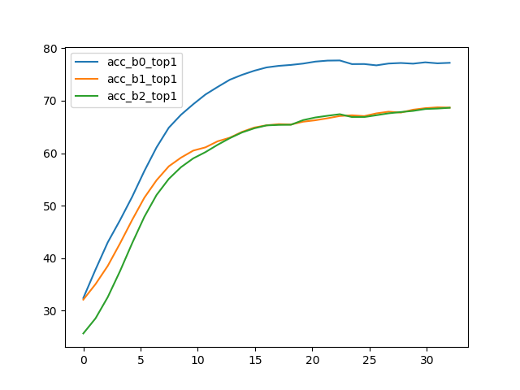
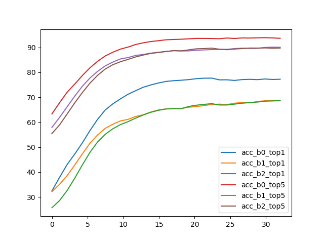
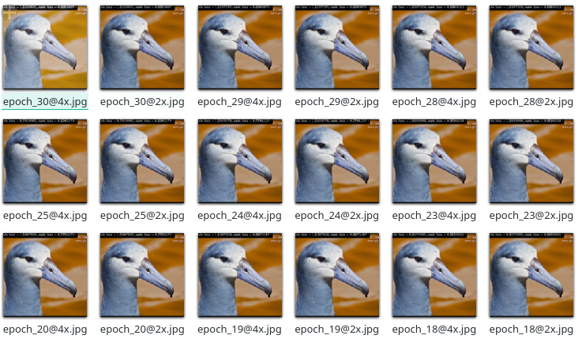

# RACNN Pytorch Implementation 

This is a mobilenet version of RACNN.

Referred from [another cool pytorch implementation](https://github.com/jeong-tae/RACNN-pytorch) .

## Requirements

- python

- pytorch 1.2.0

- torchvision 0.4.0

- matplotlib

## Changes

different from the origin code, several possibly important changes are applied here:

- changed backbone to mobilenet-v2 due to lack of cuda memory
- several changes on `AttentionCropFunction` in `model.py`, mentioned at https://github.com/jeong-tae/RACNN-pytorch/issues/23
- add softmax function to rank_loss according to raw paper (its not needed for cross entropy loss)
- the final stage of training is defined to train one epoch for each loss alternately, since the paper didn't mention the detail
- test accuracy using 200/725 batches for speed (just comment it out directly at `forge.py:51` if needed)

## Results

Apn pretrained with mobilenet-v2(imagenet pretrained) backbone: 

|  |  |
| ------------------------------------------------------------ | ------------------------------------------------------------ |
| zoomed input after apn-1.                                    | zoom input after apn-2.                                      |

I pretrained the mobilenet on CUB_200 dataset before training, and it helps a lot as following:

|  |  |
| ------------------------------------------------------------ | ------------------------------------------------------------ |
| zoomed input after apn-1 (with pretraining on CUB_200_2011)  | zoom input after apn-2 (with pretraining on CUB_200_2011)    |

With this, I trained the network for a little time now and the current result at epoch 30 is:

```
acc_b0_top1:    79.82673%
acc_b1_top1:    70.48267%
acc_b2_top1:    69.86386%
acc_b0_top5:    95.29703%
acc_b1_top5:    91.39851%
acc_b2_top5:    91.33663%
```

The accuracy:

 


## Usage

the CUB_200_2011 dataset [here](http://www.vision.caltech.edu/visipedia/CUB-200-2011.html). (extract it to `external/`)

1. pretrain a mobilenet-v2 on CUB_200_2011 (optional):

   ```
   $ python src/recurrent_attention_network_paper/pretrain_mobilenet.py
   ```
   
2. pretrain the apn:

   edit some configurations in `pretrain_apn.py`  here:
   
    ```
    if __name__ == "__main__":
        clean()
        run(pretrained_backbone='build/mobilenet_v2_cub200-e801577256085.pt')
    ```
   
    set the model for backbone, then:
   
   ```
    $ python src/recurrent_attention_network_paper/pretrain_apn.py
   ```

3. training:

   edit same configurations in `forge.py` , then:

   ```
    $ python src/recurrent_attention_network_paper/forge.py
   ```

outputs are generated at `build/`, including logs, frozen optimizers&model and some gifs as visualization.   


## Issues

- how to define the margin of rank loss? (since it may differs on each backbone(e.g. mobilenet), I think..)
- According to the output picture, during the final training phase, the  two outputs tend to output the full image size, which is not consistent  with the original intention of the paper. 

- other issues may happen since the training is not finished now...

## References

- https://github.com/jeong-tae/RACNN-pytorch
- [Original code](https://github.com/Jianlong-Fu/Recurrent-Attention-CNN)

